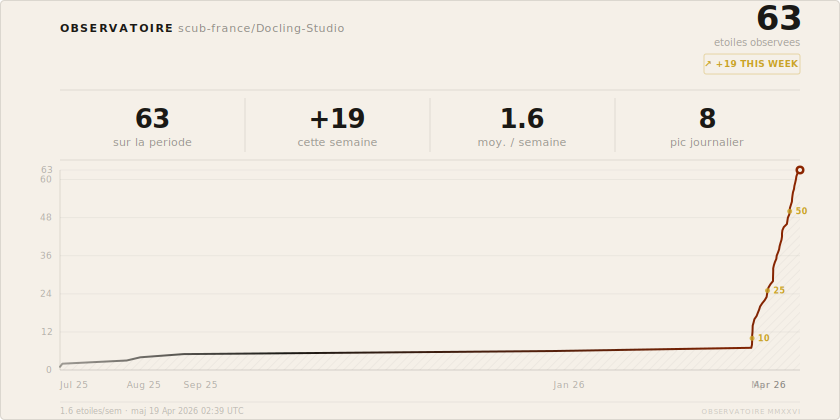

# Observatoire — Docling-Studio Stars

[](https://github.com/scub-france/Docling-Studio/stargazers)

Dashboard interactif et chart SVG embeddable pour suivre les stars de [scub-france/Docling-Studio](https://github.com/scub-france/Docling-Studio).

## Dashboard

Ouvrir [`index.html`](index.html) dans un navigateur — les donnees sont chargees en live depuis l'API GitHub.

**[Voir le dashboard en ligne](https://pjmalandrino.github.io/github-stars/)**

## SVG embeddable

Le fichier `stars.svg` est regenere automatiquement toutes les 6h et a chaque nouvelle star via GitHub Actions.

### Generer manuellement

```bash
python generate_svg.py
```

### Utiliser dans un README

```markdown
[](https://github.com/scub-france/Docling-Studio/stargazers)
```

## Stack

- HTML/CSS/JS vanilla (zero framework)
- Chart.js pour les graphiques
- API GitHub pour les donnees
- GitHub Actions pour la mise a jour automatique du SVG
